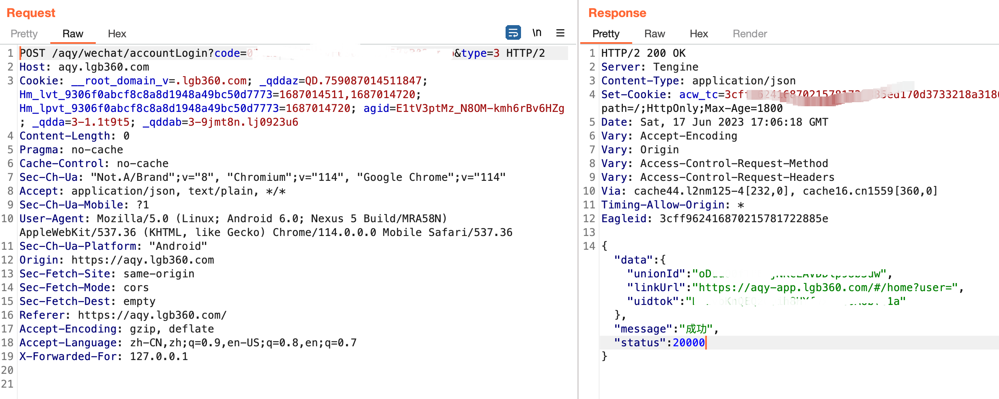
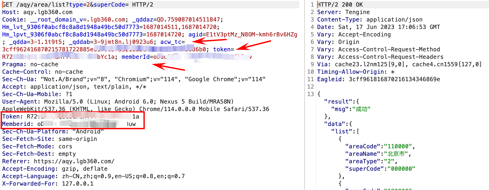
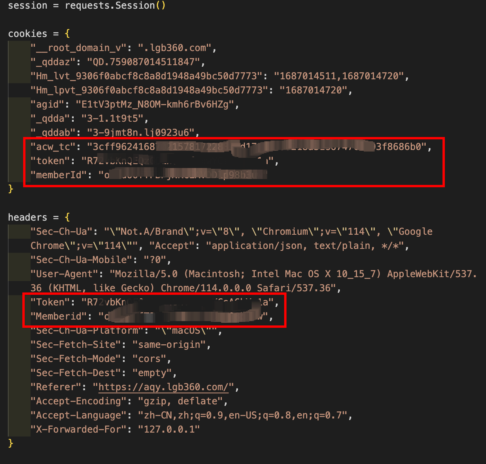
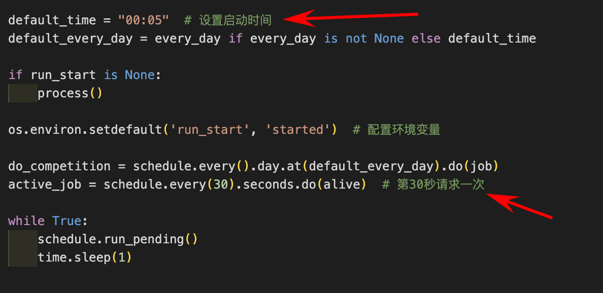

# 2023年安全生产月链工宝自动答题工具


> 今年年安全生产月（6月1日-30日）链工宝答题不像以前使用链工宝APP授权，而是采用微信小程序授权方式。因此通过以往链工宝APP登录接口授权方式已经不可行。好在微信授权也有相关接口，访问该接口后得到二维码，使用手机微信扫描登录，将登录过程抓包，获取授权信息，编写脚本并利用授权信息同样可以进行自动答题。当然，现在方法稍微比以前麻烦点。在参考以前版本，配合前端调试等操作，经过一番折腾，完成了采用微信授权自动答题脚本编写。（脚本无不良引导，安全无小事，重要的是要熟悉安全生产。工具只作为学习辅助）

---

## 准备环境

+ 1.脚本基于python3编写与调试，需要python3.7+环境。

+ 2.除`loguru、schedule`库外，其他都是标准库，因此需要安装以上两个库。

```
git clone https://github.com/rootklt/liangongbao_wechat.git
pip3 install -r requirements.txt
```


## 食用方法

+ **1.访问登录页面**

在浏览器访问以下登录地址，会得到一个微信授权二维码，做好代理和burpsuite抓包准备，使用手机扫描该二维码在微信上授权。

```
https://aqy.lgb360.com/#/login
```

+ **2.授权成功后，将得到相应的cookie、token和memberID。**




+ **3.更新脚本**

找到一个链工宝请求的包，手动更新`Process_wx.py`里的cookies和headers的token、memberID、acw_tc，或者用burpsuite的Copy-as-Python_Requests插件copy后更新脚本里的cookies和headers。

```python
# 脚本中采用大写标识需要替换的部分

TOKEN_CHANGE_ME_HERE: 替换为token
MEMBERID_CHANGE_ME_HERE: 替换为memberId
ACW_TC_CHANGE_ME_HERE: 替换为acw_tc, 这个是答题服务端返回的cookie
```





### 4.运行脚本

```
python3 main.py
```

## Others

可根据个人要求配置`main.py`中的计划时间和请求频率。



## TODO

[1]题库更新

## 参与

[https://github.com/nfjBill/liangongbao.git](https://github.com/nfjBill/liangongbao.git)